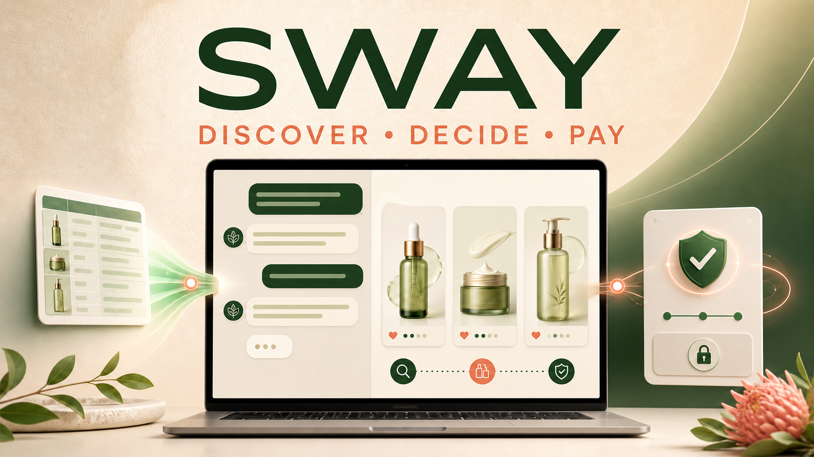
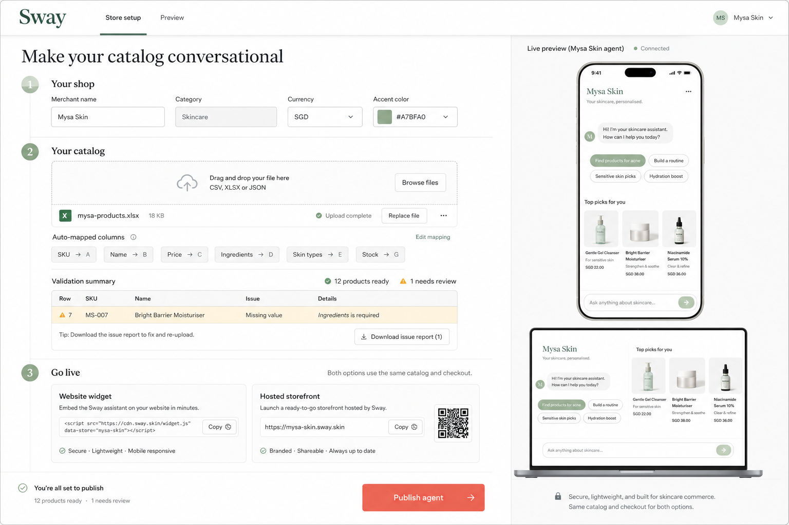
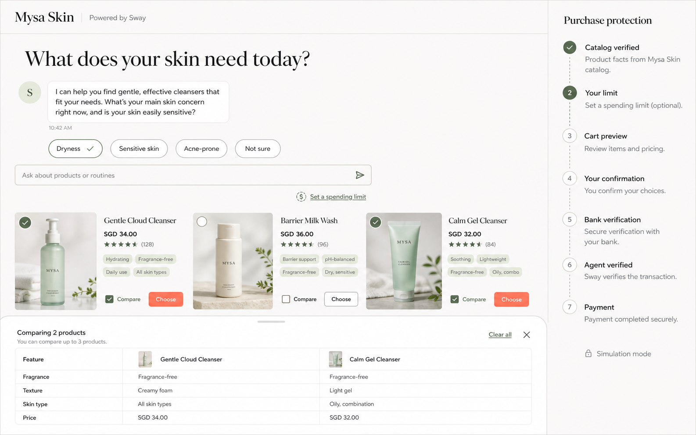
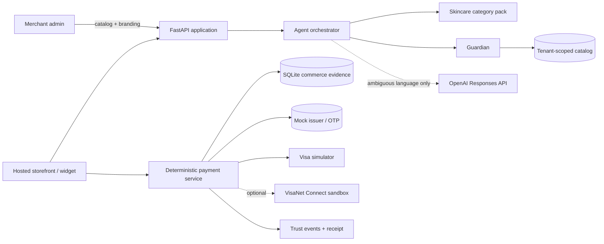

# Sway

> Turn a merchant catalog into a trusted conversational storefront that can discover, decide,
> and pay in one experience.



Sway is a plug-and-play, category-specialized commerce agent built for the Visa LifeHack 2026
challenge. A merchant can bring an ordinary spreadsheet, review deterministic catalog diagnostics,
publish a branded storefront or embeddable widget, and let shoppers move from a natural-language
need to a verified payment without being redirected to another checkout.

The current prototype specializes in **skincare**. It combines conversational discovery with
deterministic product facts, server-side pricing, explicit per-purchase consent, issuer-style OTP
verification, signed authorization evidence, and an auditable Trust Rail.

> [!IMPORTANT]
> Sway runs with a clearly labelled payment simulator by default. **No real card is charged.** An
> optional VisaNet Connect sandbox adapter exists behind configuration, but the simulator is the
> safe and deterministic demo path.

## Why Sway

Most shopping journeys split discovery, comparison, checkout, authentication, and payment across
separate pages. Smaller merchants also lack the engineering resources to build their own grounded
AI agent and trusted payment infrastructure.

Sway closes both gaps:

- **For merchants:** spreadsheet-to-agent onboarding, branding, catalog management, hosted and
  embedded deployment, and live commerce insights.
- **For shoppers:** category-aware recommendations, routines, comparisons, cart and checkout in a
  single storefront experience.
- **For trust:** a signed permission chain proving that the shopper approved this exact cart,
  amount, merchant, card, and delivery address.

## Interface preview

These design previews show the intended merchant and shopper experiences. For the final submission,
replace them with live captures using the screenshot checklist below.

| Merchant onboarding and deployment | Conversational shopping and purchase protection |
| --- | --- |
|  |  |

## End-to-end journey

### 1. Merchant: catalog to live agent

1. Register a merchant and receive a tenant-scoped merchant key.
2. Download the canonical skincare workbook or upload XLSX, CSV, or structured JSON.
3. Review exact column mappings, ignored fields, rejected rows, and grouped diagnostics.
4. Approve a staged replace or upsert plan before any live catalog data changes.
5. Upload an optional image ZIP and deterministically match files to products.
6. Customize the merchant name, accent color, logo, and storefront identity.
7. Publish a hosted storefront and copy the one-line website widget snippet.
8. Manage products and monitor customers, revenue, orders, tasks, and conversion from the CRM.

### 2. Shopper: discover and decide

1. Browse anonymously or sign in to use saved delivery details.
2. Ask category questions such as “What products do you have?” or describe a skincare concern.
3. Receive catalog-grounded recommendations and a routine assembled for the stated profile.
4. Inspect product details, ratings, ingredients, concerns, skin types, price, and stock.
5. Compare products side by side and add selected products to the cart.
6. Optionally set or update a session spending limit.

### 3. Shopper: consent and pay

1. Sway creates a server-priced cart using the current merchant catalog.
2. The shopper reviews the exact items, total, merchant, masked card, and shipping address.
3. An explicit confirmation creates a payment mandate for that exact transaction.
4. The mock issuer authenticates the shopper with a single-use OTP challenge.
5. A TAP-shaped signed payer request is verified before authorization.
6. The payment simulator authorizes the transaction and records an immutable order snapshot.
7. The receipt and authorization trail remain visible in the same experience.

## Features

### AI agent layer

- Skincare-specialized category pack with concern, skin-type, ingredient, routine, and product-type
  knowledge.
- Product discovery, grounded recommendations, routine planning, product questions, category
  browsing, and deterministic comparison.
- One structured OpenAI Responses API interpretation call for ambiguous turns when live AI mode is
  enabled.
- Deterministic demo mode for repeatable, offline-friendly judging.
- A Guardian validates the interpreted route, merchant scope, category, selected SKUs, and product
  claims before results reach the shopper.
- Catalog facts remain authoritative: the model never invents a price, stock level, SKU, rating, or
  product.

### Merchant integration

- Self-service merchant registration and tenant-scoped API keys.
- Canonical XLSX template with required fields, instructions, and validation helpers.
- XLSX, CSV, and `catalog-source.v1` JSON ingestion.
- Deterministic header aliases and transparent mapping reports—unknown columns are reported, never
  guessed.
- Staged review and explicit approval before replace or upsert publication.
- Row-level validation and grouped, actionable catalog diagnostics.
- Formula-like content, ambiguous mappings, unsafe image URLs, macros, and external workbook links
  are quarantined or rejected.
- Optional ZIP image upload with deterministic SKU/title matching and strict archive safety limits.
- Merchant branding through store name, logo, and accent color.
- Private product creation and editing with immediate visibility in a published storefront.
- Hosted storefront plus an isolated, responsive one-line widget using a sandboxed iframe and Shadow
  DOM host.
- Multi-tenant catalog, shopper, cart, and insight isolation.

### Conversational shopping experience

- Anonymous discovery, category browsing, recommendations, routines, and comparison.
- Optional customer accounts with saved delivery addresses.
- Product cards with images, prices, ratings, stock-backed availability, and progressive details.
- Side-by-side comparison across relevant skincare attributes.
- Persistent cart sidebar and optional session spending limit.
- Inline card, address, consent, bank verification, and receipt surfaces—no external checkout
  redirect.
- Only the card brand, expiry, holder, and last four digits are retained; the full card number is
  checked and discarded, and is never sent to the shopping model.

### Payments, consent, and trust

- Safe simulated Visa authorization by default.
- Optional VisaNet Connect sandbox authorization adapter with mutual TLS, Basic authentication, and
  JWE message-level encryption.
- AP2-shaped **Intent → Cart → Payment** mandate chain with Ed25519 signatures.
- The cart hash binds products, quantities, server-calculated amount, merchant, and shipping address.
- Human confirmation is recorded before any payment authorization can run.
- Issuer-style OTP verification produces a cart-bound, single-use bank token.
- TAP-shaped HTTP message signatures verify the agent payer request.
- Idempotency and nonce/token replay protection.
- Deterministic refusal of over-budget, expired, superseded, mismatched, replayed, or edited
  transactions.
- Persistent trust-event audit log exposed in the shopper-facing **Visa Purchase Protection** rail.
- Immutable receipt and order evidence for the approved transaction.

### Merchant CRM

- Live revenue, order, and customer KPIs with period-over-period comparisons.
- Revenue series and a clearly labelled trailing-seven-day arithmetic forecast.
- Customer activity, conversion, average order value, repeat rate, and lifetime spend.
- Product performance, inventory status, photo coverage, and catalog controls.
- Actionable tasks for low stock, missing photos, abandoned carts, failed checkouts, and unpublished
  changes.
- Merchant data summaries generated from deterministic reports; an optional model may rephrase the
  answer, but any rewrite that introduces a new number is rejected.
- Every dashboard route and calculation is scoped to the authenticated merchant.

## Architecture



Sway is a modular monolith: one FastAPI process with separate `agent`, `merchant`, and `payments`
boundaries. This keeps the demo restartable while preserving explicit trust and ownership seams.

The governing rule is:

> **Facts travel through deterministic code; only phrasing travels through a model. No language
> model runs from cart creation through payment and order creation.**

## Trust model

The Trust Rail is a user-facing view of controls that are enforced on the server:

1. **Catalog verified** — product facts are read from the active merchant catalog.
2. **Spending limit** — an optional signed intent mandate caps the session.
3. **Cart preview** — current prices and delivery details are hashed and signed.
4. **Human confirmation** — consent is bound to the exact cart.
5. **Bank verification** — the mock issuer returns a single-use, cart-bound token.
6. **Agent verified** — the signed payer request and nonce are checked.
7. **Payment** — one idempotent authorization creates the order and receipt.

Runtime evidence is persisted in `trust_events` and is available through
`GET /trust/events/snapshot` or the `GET /trust/events` event stream. This is an action and outcome
audit trail, not a private model chain-of-thought log.

## Technology stack

| Layer | Technology |
| --- | --- |
| Frontend | React 19, TypeScript, Vite, CSS, Lucide React, QR Code React |
| Backend | Python 3.11+, FastAPI, Pydantic, Uvicorn |
| Data | SQLite commerce and mock-issuer databases |
| AI | OpenAI Responses API; `gpt-5-mini` default; deterministic demo fallback |
| Catalog | OpenPyXL, CSV/JSON parsing, multipart uploads, safe ZIP image ingestion |
| Trust | `cryptography`, Ed25519, TAP-shaped HTTP signatures, signed mandates |
| Visa adapter | HTTPX mutual TLS and JoseRFC JWE for the optional sandbox path |
| Testing | Pytest, Ruff, TypeScript compiler, Playwright |
| Tooling | `uv` for Python dependencies; npm for the web application |

## Run locally

Prerequisites: **Python 3.11+**, **Node.js 20+**, `uv`, and npm.

### PowerShell

```powershell
python -m venv .venv
.\.venv\Scripts\python.exe -m pip install -e ".[dev]"
npm --prefix web install
.\.venv\Scripts\python.exe -m seed.reset
.\.venv\Scripts\python.exe -m scripts.dev
```

### Demo surfaces

- Landing page: <http://localhost:5173/>
- Shopper storefront: <http://localhost:5173/storefront?merchant=m_mysa>
- Merchant CRM: <http://localhost:5173/admin>
- Merchant setup: <http://localhost:5173/admin/setup>
- API documentation: <http://localhost:8000/docs>
- Widget demonstration: <http://localhost:5173/widget-demo.html>

Demo details:

- Payment mode: `simulator`
- Mock issuer OTP: `492118`
- Seeded merchant: Mysa Skin (`m_mysa`)
- Demo mode: deterministic unless `DEMO_MODE=0` and `OPENAI_API_KEY` is configured

## Verify

With the application running for browser tests:

```powershell
.\.venv\Scripts\ruff.exe check app agent merchant payments seed scripts tests
.\.venv\Scripts\python.exe -m pytest -q
npm --prefix web run build
npm --prefix web run test:e2e
```

The regression suite covers the shopper flow, catalog ingestion, image safety, product management,
tenant isolation, route authorization, payment constraints, Visa adapter boundaries, trust events,
and merchant insights.

## Repository map

| Path | Purpose |
| --- | --- |
| `app/` | FastAPI entry point, settings, authentication, database schema, and shared errors |
| `agent/` | Interpreter, recommender, adviser, Guardian, router, and skincare category pack |
| `merchant/` | Onboarding, catalog ingestion, images, products, consumer identity, and CRM insights |
| `payments/` | Cards, mandates, mock issuer, signatures, authorization, Visa adapter, and receipts |
| `web/` | React storefront, embeddable widget, merchant setup, CRM, and Playwright tests |
| `seed/` | Deterministic merchant, catalog, customer, and trading-history data |
| `tests/` | Backend and security regression suite |
| `docs/` | Architecture, contracts, ingestion, security, UX, dashboard, and testing notes |

## Screenshot capture checklist

For the final submission, capture the live app at approximately **1440×900 or 1600×900**, keep the
browser zoom consistent, and avoid showing API keys, local file paths, email addresses, or full card
details. Recommended files:

| File to add | Capture |
| --- | --- |
| `docs/screenshots/merchant-onboarding.png` | Catalog mapping and cleaning preview with the live storefront preview visible |
| `docs/screenshots/catalog-images.png` | Image ZIP matching report and product thumbnails |
| `docs/screenshots/shopper-discovery.png` | The dry/sensitive-skin routine with grounded product cards |
| `docs/screenshots/product-comparison.png` | Side-by-side product comparison and active spending limit |
| `docs/screenshots/trusted-checkout.png` | Exact transaction preview beside the expanded Purchase Protection rail |
| `docs/screenshots/payment-receipt.png` | Completed receipt and successful verification events |
| `docs/screenshots/merchant-dashboard.png` | Revenue KPIs, chart, priority tasks, and customer table |

Once captured, replace the two interface-preview image links near the top of this README with the
best live merchant and shopper screenshots. Keep the remaining images for a compact walkthrough
gallery rather than placing every capture above the fold.

## Prototype boundaries

- The implemented category pack is skincare; adding another category requires a new schema and
  guardrail pack.
- The payment simulator is the default and does not charge a real card.
- The VisaNet Connect client is an optional sandbox adapter, not a claim of production payment
  certification.
- SQLite and in-process throttling are appropriate for the prototype; a production deployment would
  use managed persistence, distributed rate limiting, key rotation, secret management, and narrower
  CORS policy.

## Documentation

- [Architecture decision aid](docs/architecture-flowchart.md)
- [Catalog ingestion contract](docs/catalog-ingestion.md)
- [Merchant CRM](docs/merchant-dashboard.md)
- [Security and tenant isolation](docs/security.md)
- [API contracts](docs/contracts.md)
- [Testing notes](docs/testing.md)
