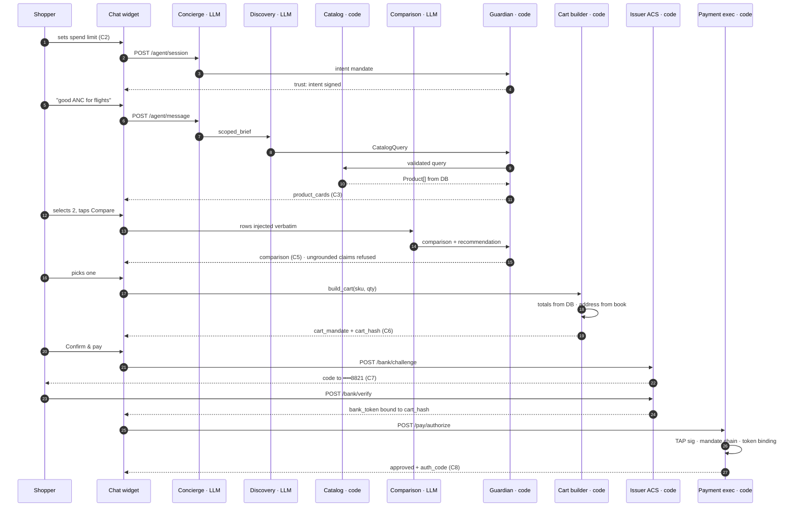

# AGENT WORKFLOW — step-by-step execution spec

> **Purpose.** One turn of the agentic flow, decomposed into every step that runs, with the exact
> **input**, **output** and **tools** for each. This is the file a Codex window implements against.
>
> **Authority.** Types and endpoints come from `docs/contracts.md` **v0.11** — if this file and
> contracts disagree, **contracts wins** and this file is the bug. Screens referenced as `C1`–`C9`
> and `M1`–`M3` are specified in `docs/ux.md` and drawn in `docs/wireframes.html`.
>
> **Author.** Claude Code / Aryan, T+2:05. Owners are proposals until the huddle claims them.

---

## 0. How to read this

Every step is one block with the same six parts:

| Part | Means |
|---|---|
| **Header table** | Actor, owner + file + task ID, trigger, latency and cost budget |
| **Input** | The exact payload the step receives. Field names are contract names |
| **Process** | What the step does. Numbered when order matters |
| **Output** | The exact payload it emits, and where that goes next |
| **Tools** | Every tool the step needs, typed (see the legend below) |
| **Guards / failures** | Guardian checks applied, trust events emitted, and the failure codes |

**Tool kinds**, used consistently throughout:

| Kind | Meaning |
|---|---|
| `LLM` | A model call. Always with a forced or offered function schema — never free-text JSON parsing |
| `FN` | A function/tool definition exposed to a model |
| `HTTP` | A call to one of our own routers over real localhost HTTP (so signatures are real) |
| `LIB` | A third-party library |
| `DB` | A SQLite table read or write |
| `UI` | A client-side capability with no server hop |

### The rule that governs every step

> **Facts travel through code. Only phrasing travels through a model. From the cart down, there is
> no model at all.**

Concretely: steps whose actor is `LLM` may never originate a price, a rating, a SKU or a total.
They receive those as injected facts and may only rearrange words around them. Every LLM output
passes the Guardian before the next step sees it.

### Actors at a glance

| Actor | Kind | Module | Owner | Task |
|---|---|---|---|---|
| Concierge | LLM (nano) | `agent/concierge.py` | Y3 | T-20a |
| Discovery | LLM (mini) | `agent/specialists/discovery.py` | Y3 | T-20b |
| Catalog service | code | `merchant/search.py` | Aryan | T-41 |
| Comparison | LLM (mini) | `agent/specialists/comparison.py` | Y3 | T-20c |
| Guardian | code | `agent/guardian.py` | Y3 | T-25 |
| Cart builder | code | `payments/cart.py` | Y4 | T-10 |
| Address book | code | `merchant/consumer.py` | Aryan | T-43 |
| Issuer ACS | code | `payments/bank.py` | Y4 | T-14 |
| Payment executor | code | `payments/authorize.py` | Y4 | T-10 |
| TAP middleware | code | `payments/tap.py` | Y4 | T-12 |
| Chat widget | UI | `web/src/chat/` | Y2 | T-30 |
| Trust Panel | UI | `web/src/trust/` | Y2 | T-31 |

---

## 1. The whole turn, in one picture



**Phases:** 0 bootstrap · 1 discovery · 2 evaluation · 3 cart and consent · 4 bank authentication ·
5 authorisation · 6 refusal paths.

---

## PHASE 0 — Session bootstrap

### S0.1 — Widget boot

| | |
|---|---|
| **Actor** | Chat widget (UI) |
| **Owner** | Y2 · `web/src/chat/boot.ts` · T-30 |
| **Trigger** | The merchant's embed snippet executes on page load, or the demo stage mounts |
| **Budget** | ≤300 ms to first paint · $0 |

**Input** — from the snippet's own URL, nothing else:

```
<script src="https://agentready.dev/a/m_lumen.js" async></script>
                                   └── merchant_id
```

**Process**

1. Read `merchant_id` from the script's own `src`.
2. `GET /merchant/{id}/config` → persona, category, currency, spend ceiling.
3. Render the collapsed launcher. **Do not create a session yet** — a session that exists before
   the shopper speaks burns an intent mandate that will expire unused.

**Output** — client state only:

```jsonc
{ "merchant_id":"m_lumen", "category":"electronics", "currency":"SGD",
  "default_cap_cents": 15000, "persona": { "greeting": "…" } }
```

**Tools**

| Tool | Kind | Detail |
|---|---|---|
| `GET /merchant/{id}/config` | HTTP | Public, unsigned. The only unauthenticated call in the flow |
| `localStorage` | UI | Remembers a collapsed/expanded launcher between page loads. Wrap in try/catch |

**Guards / failures** — unknown `merchant_id` → the launcher never renders and a console warning
fires. **Never render a broken widget on a merchant's live site.**

---

### S0.2 — Session create and Intent Mandate

| | |
|---|---|
| **Actor** | Concierge (LLM only for the greeting) + Guardian |
| **Owner** | Y3 · `agent/session.py` · T-20a, T-22 |
| **Trigger** | The shopper sets a spend limit on **C2**. This gesture *is* the consent artifact |
| **Budget** | ≤600 ms · ~$0.0002 |

**Input**

```jsonc
// POST /agent/session
{ "merchant_id": "m_lumen", "consumer_id": "usr_demo",
  "category": "electronics", "budget_cents": 15000 }
```

**Process**

1. Load the category pack `agent/packs/electronics.json` → `system`, `attribute_schema`,
   `salient_dims`, `comparison_dimensions`, `guardrails`, `few_shot`.
2. Build the **Intent Mandate**: category, cap, currency, merchant scope, 15-minute expiry.
3. Sign it with the agent's ed25519 key; `POST /pay/mandates` to record it.
4. Instantiate the specialists **for this session only**, from this pack. The other packs are not
   loaded — that is the category-isolation guarantee, and it is structural, not a prompt instruction.

**Output**

```jsonc
{ "session_id": "ses_01J…", "intent_mandate_id": "mnd_4kz",
  "greeting": "Hi — I can find things, compare them, and check you out right here." }
```

**Tools**

| Tool | Kind | Detail |
|---|---|---|
| `POST /pay/mandates` | HTTP | Signed, `tag=agent-payer-auth`. Records the intent link |
| `cryptography` | LIB | ed25519 sign over canonical JSON |
| `agent/packs/*.json` | DB | Read-only data file. **Exactly one pack loads per session** |
| `sessions`, `mandates` | DB | Insert |

**Guards / failures**

- `budget_cents` above the merchant's configured ceiling → clamp to the ceiling and say so in the UI.
- `budget_cents <= 0` → reject before signing; the UI keeps the control open.
- **Trust event:** `{stage:"mandate", label:"Spend limit set", status:"ok"}` → Trust Panel link 1.

---

## PHASE 1 — Discovery

### S1.1 — Concierge routes the turn

| | |
|---|---|
| **Actor** | Concierge (LLM, nano tier) |
| **Owner** | Y3 · `agent/concierge.py` · T-20a |
| **Trigger** | `POST /agent/message` |
| **Budget** | ≤350 ms · ~$0.0003 |

**Input** — note what is *absent*: no product rows, no prices, no card, no address.

```jsonc
{ "session_id": "ses_01J…",
  "transcript": [ {"role":"user","content":"good ANC for flights"} ],
  "scope": { "category":"electronics", "merchant_ids":["m_lumen"],
             "max_amount_cents":15000, "intent_mandate_id":"mnd_4kz" },
  "state": { "cards_shown": [], "selected_skus": [], "cart_open": false } }
```

**Process** — one model call with four routing functions offered. The model picks exactly one.

**Output** — a `scoped_brief` envelope addressed to a specialist, or user-facing text:

```jsonc
{ "hop_id":"hop_01J…", "session_id":"ses_01J…",
  "from":"concierge", "to":"discovery", "type":"scoped_brief",
  "scope": { /* copied verbatim — a specialist may never widen it */ },
  "payload": { "query_text":"noise cancelling over-ear for flights", "refine": false } }
```

**Tools**

| Tool | Kind | Detail |
|---|---|---|
| Chat completion | LLM | nano tier, `temperature 0.2`, `max_tokens 200` |
| `route_to_discovery` | FN | `{query_text:string, refine:boolean}` |
| `route_to_comparison` | FN | `{skus:string[]}` — 2–3 entries, must be in `state.cards_shown` |
| `route_to_cart` | FN | `{sku:string, qty:integer}` |
| `reply_directly` | FN | `{text:string}` — greetings, refusals, clarifying questions |
| Prompt cache | LIB | The system prompt and pack header are stable per session — cache them |

**Guards / failures**

- Model returns no tool call → retry once at `temperature 0`, then `reply_directly` with a
  clarifying question. **Never** fabricate a route.
- `route_to_comparison` naming a SKU not in `state.cards_shown` → Guardian refuses,
  `OUT_OF_SCOPE_PRODUCT`.
- Off-category turn ("do you sell shoes?") → `reply_directly`. The concierge does not know what
  else exists, and that is correct.

---

### S1.2 — Discovery: language → a query object

| | |
|---|---|
| **Actor** | Discovery specialist (LLM, mini tier) |
| **Owner** | Y3 · `agent/specialists/discovery.py` · T-20b |
| **Trigger** | A `scoped_brief` hop |
| **Budget** | ≤400 ms · ~$0.0005 |

**Input** — the scoped brief from S1.1, plus the pack's `attribute_schema` so the model knows which
attribute keys exist. **It does not receive the transcript.**

**Process** — one model call with **forced** tool choice. This is the mechanism that makes "may emit
only a query" true rather than aspirational: the model has exactly one function available and is
required to call it, so prose is not a possible output.

**Output**

```jsonc
{ "hop_id":"hop_01J…", "from":"discovery", "to":"catalog", "type":"catalog_query",
  "scope": { /* unchanged */ },
  "payload": { "q":"noise cancelling over-ear",
               "max_price_cents": 15000,        // never above scope.max_amount_cents
               "attrs": { "anc": true },        // keys must exist in attribute_schema
               "limit": 5 } }
```

**Tools**

| Tool | Kind | Detail |
|---|---|---|
| Chat completion | LLM | mini tier, `temperature 0`, `max_tokens 150` |
| `emit_catalog_query` | FN | **Forced** (`tool_choice` pinned to this function), strict schema. The only function available |
| `attribute_schema` | DB | From the session's pack. Constrains the `attrs` enum |

**Guards / failures**

| Condition | Handling |
|---|---|
| Schema violation | Guardian `SCHEMA_REJECTED` → one repair attempt with the validation error appended → then fall back to a keyword-only query built in code from `query_text` |
| `max_price_cents > scope.max_amount_cents` | Silently clamped by the Guardian. Never an error the shopper sees |
| `attrs` key not in the schema | Key dropped, query still runs |
| Empty `q` | Fall back to the pack's default browse query |

---

### S1.3 — Guardian validates the query

| | |
|---|---|
| **Actor** | Guardian (code) |
| **Owner** | Y3 · `agent/guardian.py` · T-25 |
| **Trigger** | Every hop, in both directions. This is its first of four appearances per turn |
| **Budget** | ≤5 ms · $0 |

**Input** — the raw `AgentMessage` envelope from S1.2, before the catalog sees it.

**Process** — the four checks, in order, short-circuiting on the first failure:

1. **Schema** — parses into `CatalogQuery`, or it never leaves.
2. **Grounding** — n/a on an outbound query (nothing to ground yet).
3. **Scope** — `scope` is byte-identical to the session's; `max_price_cents ≤ cap`.
4. **Mandate** — the session's intent mandate is present and unexpired.

**Output** — the same envelope, marked `validated: true`, or a refusal:

```jsonc
{ "ok": false, "code": "SCHEMA_REJECTED",
  "detail": { "field": "limit", "reason": "expected integer ≤ 10, got 50" },
  "repair_allowed": true }
```

**Tools**

| Tool | Kind | Detail |
|---|---|---|
| `pydantic` | LIB | Check 1. Model classes are the contract types, generated once |
| `trust_bus.emit()` | LIB | Y4's in-process bus. Feeds `/trust/events` |

**Guards / failures** — emits one `TrustEvent` per check, pass or fail. A refused hop emits
`status:"fail"` with the failing check named, which is what makes the Trust Panel legible.

---

### S1.4 — Catalog service executes the search

| | |
|---|---|
| **Actor** | Catalog service (**code — the only origin of product facts in the system**) |
| **Owner** | Aryan · `merchant/search.py` · T-41 |
| **Trigger** | A validated `catalog_query` hop |
| **Budget** | ≤25 ms · $0 |

**Input** — the validated `CatalogQuery`, over **real HTTP** so the TAP signature is genuine:

```http
GET /catalog/search?q=noise+cancelling+over-ear&merchant_id=m_lumen
    &max_price_cents=15000&attrs=anc:true&limit=5
Signature-Input: sig1=("@authority" "@path");created=…;keyid="agent-key-1";
                 expires=…;alg="ed25519";nonce="…";tag="agent-browser-auth"
Signature: sig1=:MEUCIQ…:
```

**Process**

1. TAP middleware verifies the signature (S5.2 describes the same machinery).
2. Deterministic ranking: exact attribute matches, then keyword score, then `rating_avg` as a
   tie-break, then `sku` ascending so ordering is **stable across runs** — a demo that reorders
   between judges looks broken.
3. Project each row to the `Product` shape, **including `rating_avg`, `rating_count`,
   `rating_source`** (read from the row; see S1.5).

**Output**

```jsonc
{ "results": [ { "sku":"KS-40", "title":"Kestrel Studio 40", "price_cents":14900,
                 "currency":"SGD", "rating_avg":4.8, "rating_count":612,
                 "rating_source":"merchant_feed", "attributes":{…}, "stock":7 }, … ],
  "facets": { "price_band": {…}, "anc": {…} }, "total": 3 }
```

**Tools**

| Tool | Kind | Detail |
|---|---|---|
| `GET /catalog/search` | HTTP | Signed `tag=agent-browser-auth`. A payer-auth signature here is a hard reject |
| `httpx` | LIB | Agent-side client. Timeout 2 s, no retries on 4xx |
| SQLite `products` | DB | Read. Indexed on `(merchant_id, category, price_cents)` |
| `payments/tap.py` | LIB | Signature verification middleware |

**Guards / failures**

- Zero results → **not an error.** Returns `total: 0`; the concierge phrases a widening suggestion.
- Signature invalid/expired/replayed → `401`, `SIGNATURE_INVALID` / `NONCE_REPLAY`.
- **No network egress.** Ratings are already in the row (S1.5). Nothing in this step reaches the
  internet, which is why the flow survives dead venue wifi.

---

### S1.5 — Where ratings come from *(reference, not a runtime step)*

Ratings are read at S1.4 like any other column. They arrive there by one of two ingest-time paths,
never at query time:

| Path | When | Tool | Result |
|---|---|---|---|
| **Merchant feed** | The CSV/JSON carries `rating`/`reviews` columns | `merchant/ingest.py` T-40 | `rating_source:"merchant_feed"` |
| **Enrichment hook** | The feed lacks them and a source is configured | `merchant/enrich.py` T-40 | `rating_source:"enrichment"`, cached to the row |
| *(neither)* | No data | — | `rating_avg:null`, `rating_source:"none"` → **UI renders no stars, not zero stars** |

> **Assumption A6.** No rating is ever fetched while a shopper waits. If a Visa mentor supplies a
> ratings API on-site, it is wired into the enrichment hook and nothing downstream changes.
>
> **A rating is a fact.** It is rendered by code from the row. A model may say *"the better-reviewed
> of the two"*; it may not say a number absent from its payload. Guardian check 2 enforces this to
> one decimal place.

---

### S1.6 — Card assembly and stream

| | |
|---|---|
| **Actor** | Concierge (code path — no model call) |
| **Owner** | Y3 · `agent/stream.py` · T-20a |
| **Trigger** | Catalog rows returned and Guardian-passed |
| **Budget** | ≤30 ms · $0 |

**Input** — `Product[]` from S1.4 plus the pack's `salient_dims`.

**Process** — build the card payload **in code**, and attach the preview attributes to the same
event so the hover in S2.1 needs no network call:

```python
card = {**product_public_fields,
        "salient": {k: product["attributes"][k]
                    for k in pack["salient_dims"][:4]
                    if k in product["attributes"]},
        "attribute_total": len(product["attributes"])}   # powers "4 of 9"
```

**Output** — one SSE frame:

```jsonc
{ "type":"product_cards",
  "data": { "products":[ { …, "salient":{"battery":"45 h","anc_depth":"−38 dB",
                                         "weight":"276 g","fit":"over-ear, closed"},
                           "attribute_total": 9 } ] } }
```

**Tools**

| Tool | Kind | Detail |
|---|---|---|
| `sse-starlette` | LIB | Server-sent events on `POST /agent/message` |
| `salient_dims` | DB | From the pack. **Capped at 4** — the cap is in the contract, not the UI |

**Guards / failures** — a `salient_dims` key missing from a product is **skipped, not blanked**; a
card with two preview rows is fine, a card with an empty row is not.

---

## PHASE 2 — Evaluation

### S2.1 — Hover preview

| | |
|---|---|
| **Actor** | Chat widget (**UI only — no server hop, no model, no tools**) |
| **Owner** | Y2 · `web/src/chat/ProductCard.tsx` · T-30 |
| **Trigger** | `mouseenter` **or** `focusin` **or** `tap` on a card |
| **Budget** | ≤16 ms — one frame · $0 |

**Input** — `card.salient` and `card.attribute_total`, already in client memory from S1.6.

**Process** — render the popover anchored to the card. Close on `Esc`, `focusout`, or a second tap.

**Output** — a rendered popover. Nothing leaves the client.

**Tools** — none. **That is the design point:** the preview is instant, it works in demo mode, and
it works with the network unplugged.

**Guards / failures**

- **Hover alone is a defect.** A judge on a trackpad in a crowded hall is exactly the person who
  fails to trigger a hover, and touch and keyboard users get nothing at all. Three ways in, one way
  out.
- Screen readers receive the attributes as a description on the card, not as a hover-only surface.
- The popover must not shift layout — absolute position within the card, `overflow` handled at the
  card edge.

---

### S2.2 — Comparison

| | |
|---|---|
| **Actor** | Comparison specialist (LLM, mini tier) |
| **Owner** | Y3 · `agent/specialists/comparison.py` · T-20c |
| **Trigger** | The shopper selects 2–3 cards and clicks **Compare** on C3 |
| **Budget** | ≤900 ms · ~$0.002 — the most expensive call in the flow |

**Input** — full product rows **injected verbatim**, plus the pack's `comparison_dimensions`. The
model is given the facts; it is not asked to recall them.

```jsonc
{ "type":"product_rows",
  "payload": { "products":[ /* ≤5 complete Product rows, ratings included */ ],
               "dimensions":["rating","battery","anc_depth","weight","fit",
                             "charge_time","warranty","price"],
               "context":"long-haul flights" } }
```

**Process** — one model call, forced tool choice. The function schema requires every cell to carry
the `sku` and attribute key it came from, which is what makes S2.3's grounding check mechanical
rather than a judgement call.

**Output**

```jsonc
{ "type":"comparison",
  "payload": {
    "dimensions":[ { "key":"battery", "label":"Battery",
                     "cells":[ {"sku":"AO-1","value":"38 h"},
                               {"sku":"KS-40","value":"45 h","best":true} ] }, … ],
    "recommendation": { "sku":"KS-40",
      "reason":"Deepest cancelling, lasts a return trip, better reviewed of the two." } } }
```

**Tools**

| Tool | Kind | Detail |
|---|---|---|
| Chat completion | LLM | mini tier, `temperature 0.3`, `max_tokens 500` |
| `emit_comparison` | FN | **Forced**, strict schema. Every cell must carry `sku` + attribute key |
| `comparison_dimensions` | DB | From the pack. The full set — this is the *only* screen that shows it |

**Guards / failures** — see S2.3. On repeated failure, fall back to a **deterministic table built in
code** from the same rows, with no recommendation sentence. A plain correct table beats an eloquent
wrong one.

---

### S2.3 — Guardian grounds the comparison

| | |
|---|---|
| **Actor** | Guardian (code) |
| **Owner** | Y3 · `agent/guardian.py` · T-25 |
| **Trigger** | Comparison output, before the shopper sees a single character |
| **Budget** | ≤10 ms · $0 |

**Input** — the S2.2 payload plus the injected rows it was built from.

**Process** — **check 2 is the one that matters here.** For every cell and every number in the
recommendation prose:

1. The `sku` exists in the injected set.
2. The attribute key exists on that product.
3. The rendered value equals the DB value — **prices to the cent, ratings to one decimal**.
4. Numbers appearing in `reason` that are not in the payload → refuse.

**Output** — pass-through, or:

```jsonc
{ "ok": false, "code": "UNGROUNDED_CLAIM",
  "detail": { "sku":"KS-40", "field":"rating_avg", "claimed":"4.9", "actual":"4.8" },
  "repair_allowed": true }
```

**Tools**

| Tool | Kind | Detail |
|---|---|---|
| SQLite `products` | DB | Re-read by `sku`. **Do not trust the injected copy** — re-read the source |
| `decimal.Decimal` | LIB | Cent and one-decimal comparison. **Never float equality** |
| `trust_bus.emit()` | LIB | One event per check |

**Guards / failures**

| Failure | Code | Recovery |
|---|---|---|
| Invented SKU | `UNGROUNDED_CLAIM` | Repair once, then deterministic table |
| Price off by a cent | `UNGROUNDED_CLAIM` | Same |
| **Rating rounded up** | `UNGROUNDED_CLAIM` | Same. This is the check that stops a model talking someone into a purchase on invented evidence |
| Product outside session scope | `OUT_OF_SCOPE_PRODUCT` | Strip the row, re-render |

---

## PHASE 3 — Cart and consent

### S3.1 — Cart builder

| | |
|---|---|
| **Actor** | Cart builder (**code, in `payments/` — deliberately next to the money, not next to the model**) |
| **Owner** | Y4 · `payments/cart.py` · T-10 |
| **Trigger** | `route_to_cart`, or the shopper taps **Choose** on a card |
| **Budget** | ≤40 ms · $0 |

**Input** — SKUs and quantities only. **No prices cross this boundary.**

```jsonc
{ "type":"cart_request", "payload": { "items":[ {"sku":"KS-40","qty":1} ] },
  "scope": { "merchant_ids":["m_lumen"], "max_amount_cents":15000,
             "intent_mandate_id":"mnd_4kz" } }
```

**Process**

1. Re-read every price from `products`. **Totals are computed here, never carried over** from
   anything a model touched.
2. `GET /consumer/{id}/addresses` → the `is_default` address (S3.2).
3. Compute `cart_hash` over
   `{items, total_cents, currency, merchant_id, shipping_address_id, shipping_address_fingerprint}`.
4. Sign the **Cart Mandate**, parented to the intent mandate.

**Output**

```jsonc
{ "type":"cart", "payload": {
    "cart_mandate_id":"mnd_7pq", "cart_hash":"sha256:9f3c…",
    "items":[ {"sku":"KS-40","title":"Kestrel Studio 40","qty":1,"unit_price_cents":14900} ],
    "total_cents":14900, "currency":"SGD",
    "shipping": { "address_id":"adr_01J…", "recipient":"Aryan D.",
                  "line":"14 Prince George's Park, #05-21, Singapore 118420" },
    "delivery_estimate":"Tue 1 Sep", "card_last4":"4821" } }
```

**Tools**

| Tool | Kind | Detail |
|---|---|---|
| SQLite `products` | DB | Authoritative price read |
| `GET /consumer/{id}/addresses` | HTTP | Internal, unsigned |
| `POST /pay/mandates` | HTTP | Signed `tag=agent-payer-auth` |
| `cryptography` | LIB | ed25519 + SHA-256 over canonical JSON |

**Guards / failures**

- `total_cents > scope.max_amount_cents` → **stop here.** Emit `AMOUNT_EXCEEDS_MANDATE` and render
  C9. The bank is never contacted and the network is never called — that is the sentence to say to a
  judge.
- Out of stock, unknown SKU, qty ≤ 0 → refuse with a specific message.

---

### S3.2 — Address resolution

| | |
|---|---|
| **Actor** | Address book (code) |
| **Owner** | Aryan · `merchant/consumer.py` · T-43 |
| **Trigger** | Called inline by S3.1 |
| **Budget** | ≤10 ms · $0 |

**Input** — `consumer_id`.

**Process** — return the `is_default` address. If the consumer has none, the cart build **pauses**
and the concierge asks for one; a cart cannot be signed without a shipping destination because the
address is inside the hash.

**Output** — an `Address`, plus `shipping_address_fingerprint` = SHA-256 of the normalised
`recipient + lines + postal_code + country`.

**Tools** — `GET /consumer/{id}/addresses` (HTTP) · SQLite `addresses` (DB) · `hashlib` (LIB).

**Guards / failures** — the fingerprint is what makes the ship-to line on C6 **tamper-evident rather
than decorative**: an agent that swaps the address after consent produces a different `cart_hash`,
the issuer token stops matching it, and authorisation fails with `SHIPPING_ADDRESS_MISMATCH`.

---

### S3.3 — Consent (C6)

| | |
|---|---|
| **Actor** | Shopper. **The only step in this document whose actor is a human** |
| **Owner** | Y2 · `web/src/chat/ConsentSheet.tsx` · T-30 |
| **Trigger** | A signed cart mandate arrives |
| **Budget** | Unbounded — never time out a human. The *mandate* expires, the UI does not nag |

**Input** — the S3.1 cart payload.

**Process** — render C6: ship-to first (as every checkout page orders it), then merchant, item,
delivery, card, total. Then the gold scope band, then `Confirm & pay S$149.00` with **the amount on
the button**. Warn before the handoff: *"Your bank will ask you to approve this next"* — an
unannounced bank prompt reads as a phishing attempt.

**Output**

```jsonc
{ "confirmed": true, "at":"2026-08-29T12:03:41Z",
  "cart_mandate_id":"mnd_7pq", "cart_hash":"sha256:9f3c…" }
```

**Tools**

| Tool | Kind | Detail |
|---|---|---|
| `GET /trust/events?session_id=` | HTTP | SSE. Drives the 7-link rail |
| Idempotency key | UI | Derived from `cart_mandate_id`. **A double-clicked Confirm must not double-charge** |

**Guards / failures** — mandate expired while the shopper deliberated → `MANDATE_EXPIRED`, and the
UI offers to rebuild the cart at current prices rather than silently re-signing.

---

## PHASE 4 — Bank authentication

### S4.1 — Issuer challenge

| | |
|---|---|
| **Actor** | Issuer ACS (code — a **mock bank**, `Meridian Bank`) |
| **Owner** | Y4 · `payments/bank.py` · T-14 |
| **Trigger** | Confirm pressed on C6 |
| **Budget** | ≤50 ms · $0 |

> **Keep this router's store separate from the authoriser's.** The ACS must be able to refuse *us*.
> If it shares state with `/pay/authorize`, the demo's most interesting refusals become
> self-inflicted and stop proving anything.

**Input**

```jsonc
// POST /bank/challenge
{ "consumer_id":"usr_demo", "cart_hash":"sha256:9f3c…",
  "amount_cents":14900, "currency":"SGD", "merchant_id":"m_lumen" }
```

**Process** — create a challenge bound to exactly this `{cart_hash, amount, merchant}`, pick the
method, start a 5-minute TTL.

**Output**

```jsonc
{ "challenge_id":"chl_01J…", "method":"otp",
  "masked_target":"•••• 8821", "expires_at":"2026-08-29T12:08:41Z" }
```

**Tools** — `POST /bank/challenge` (HTTP, signed `tag=agent-payer-auth`) · SQLite `bank_challenges`
(DB) · `secrets.token_hex` (LIB).

**Guards / failures** — a challenge for a `cart_hash` that does not match a signed cart mandate is
refused at creation. The bank does not issue tokens for carts nobody consented to.

---

### S4.2 — Verify and mint the token (C7)

| | |
|---|---|
| **Actor** | Issuer ACS + shopper |
| **Owner** | Y4 · `payments/bank.py` · T-14 · UI Y2 · T-35 |
| **Trigger** | The shopper enters the code on C7 |
| **Budget** | ≤50 ms server · $0 |

**Input** — `{ "challenge_id":"chl_01J…", "code":"492118" }`

**Process**

1. Constant-time compare. Three wrong attempts → `429`, challenge locked.
2. Mint an `IssuerToken`: `single_use`, 5-minute TTL, `bound` to `{cart_hash, amount_cents,
   merchant_id}`, `eci: "05"` (authenticated).

**Output**

```jsonc
{ "status":"approved", "bank_token":"btk_01J…", "eci":"05",
  "issuer":"Meridian Bank", "expires_at":"2026-08-29T12:08:41Z" }
```

**Tools**

| Tool | Kind | Detail |
|---|---|---|
| `POST /bank/verify` | HTTP | Called by the **client**, not the agent. Neither the merchant nor the agent ever sees the code |
| SQLite `bank_tokens` | DB | Separate table, separate store from `payment_tokens` |
| `hmac.compare_digest` | LIB | Constant-time comparison |

**Guards / failures** — `BANK_AUTH_DECLINED` on a wrong code; `429` after three. **In `DEMO_MODE`
the code is fixed at `492118`, and every binding rule above still runs for real** — the refusals
must be genuine even with the network off, or the demo proves nothing.

---

### S4.3 — Payment Mandate

| | |
|---|---|
| **Actor** | Payment executor (code) |
| **Owner** | Y4 · `payments/authorize.py` · T-10 |
| **Trigger** | A bank token is in hand |
| **Budget** | ≤20 ms · $0 |

**Input** — the cart mandate, the human confirmation from S3.3, and the bank token from S4.2.

**Output** — the third and final link of the chain, parented to the cart mandate:

```jsonc
{ "type":"payment", "parent_id":"mnd_7pq",
  "payload": { "cart_hash":"sha256:9f3c…", "token_id":"tok_01J…",
               "bank_token":"btk_01J…", "eci":"05",
               "human_confirmation": { "method":"click", "at":"2026-08-29T12:03:41Z" } } }
```

**Tools** — `POST /pay/mandates` (HTTP, signed) · `cryptography` (LIB) · SQLite `mandates` (DB).

---

## PHASE 5 — Authorisation

### S5.1 / S5.2 — Sign, then verify at the edge

| | |
|---|---|
| **Actor** | Agent signer → TAP middleware |
| **Owner** | Y3 `agent/signing.py` T-22 → Y4 `payments/tap.py` T-12 |
| **Budget** | ≤15 ms combined · $0 |

**Process** — RFC 9421 HTTP message signature over
`@authority @path created keyid expires alg nonce tag`, with **`tag=agent-payer-auth`**. The
middleware resolves `keyid` in the agent registry, verifies, and checks the nonce cache for replay.

**Tools** — `payments/tap.py` (LIB, hand-rolled from the spec, ~80 lines) · `cryptography` (LIB) ·
nonce cache (DB) · agent registry (DB).

**Guards / failures** — `SIGNATURE_INVALID` · `NONCE_REPLAY` · expired `created`/`expires` · **a
browse-auth signature presented to a payment route is a hard reject**, and that distinction is part
of the pitch.

> **Slip rule.** If T-12 overruns 45 minutes, drop to HMAC envelopes with **identical field shapes**.
> The narrative survives, the chain still verifies, and nothing downstream changes.

---

### S5.3 / S5.4 — Constraint checks and the decision

| | |
|---|---|
| **Actor** | Payment executor (code) |
| **Owner** | Y4 · `payments/authorize.py` · T-10, T-14 |
| **Budget** | ≤40 ms · $0 |

**Input**

```jsonc
// POST /pay/authorize
{ "token_id":"tok_01J…", "payment_mandate_id":"mnd_9xy", "bank_token":"btk_01J…",
  "amount_cents":14900, "currency":"SGD", "merchant_id":"m_lumen" }
```

**Process** — every check runs before any decision. **Order matters: cheapest and most specific
first, so the decline code names the real cause.**

| # | Check | Code on failure |
|---|---|---|
| 1 | Mandate chain verifies, intent → cart → payment | `SIGNATURE_INVALID` |
| 2 | Intent mandate unexpired | `MANDATE_EXPIRED` |
| 3 | `amount ≤ intent.max_amount_cents` | `AMOUNT_EXCEEDS_MANDATE` |
| 4 | `merchant_id` matches the cart mandate | `MERCHANT_MISMATCH` |
| 5 | Recomputed `cart_hash` matches the signed one | `CART_HASH_MISMATCH` |
| 6 | Shipping fingerprint matches the signed one | `SHIPPING_ADDRESS_MISMATCH` |
| 7 | `bank_token` present | `BANK_TOKEN_MISSING` |
| 8 | Bank token unexpired | `BANK_TOKEN_EXPIRED` |
| 9 | Bank token `status != consumed` | `BANK_TOKEN_REUSED` |
| 10 | `bank_token.bound` == this cart hash, amount, merchant | `BANK_TOKEN_CART_MISMATCH` |
| 11 | Payment token unused, unexpired, merchant-locked | `TOKEN_REUSED` / `TOKEN_REVOKED` |
| 12 | Human confirmation present | `HUMAN_NOT_PRESENT` |

**Output** — approved, or declined. **A business decline is HTTP 200**, never a 4xx or 5xx:

```jsonc
{ "status":"approved", "transaction_id":"txn_01J…", "auth_code":"7K2M91",
  "eci":"05", "issuer":"Meridian Bank", "amount_cents":14900 }
```

**Tools** — SQLite `mandates`, `payment_tokens`, `bank_tokens`, `transactions` (DB) ·
`cryptography` (LIB) · `trust_bus.emit()` (LIB, one event per check — this is what draws the rail).

**Guards / failures** — on approval, mark the bank token `consumed` and the payment token `used`
**in the same transaction as the authorisation write**, or a race makes replay possible.

---

### S5.5 / S5.6 — Capture and receipt (C8)

| | |
|---|---|
| **Actor** | Payment executor → chat widget |
| **Owner** | Y4 T-10 → Y2 T-30 |
| **Budget** | ≤30 ms · $0 |

**Output** — `POST /pay/capture`, then a `receipt` SSE frame carrying order id, `auth_code`,
**`Verified by Meridian Bank`**, the shipping line and the delivery estimate. Naming the issuer on
the receipt closes the loop opened on C7 and is what a shopper checks when something looks wrong.

The thread continues. Nothing redirected anywhere — that *is* the "no redirects" requirement, made
visible.

---

## PHASE 6 — The three refusal paths

All three are real checks, not scripted branches. Rehearse all three; lead with the first.

### R1 — Over the limit

| | |
|---|---|
| **Provoke** | Ask for the S$189 model against a S$150 cap |
| **Fails at** | **S3.1**, in the cart builder |
| **Code** | `AMOUNT_EXCEEDS_MANDATE` |
| **Screen** | C9, with `Raise limit to S$189` and `Show options under S$150` |
| **Proves** | The cap is enforced by the payment layer, not the model's good manners |

The rail shows four links green, one red, and **three dead** — the shopper was never asked, the bank
was never troubled, the network was never called. The refusal happened before any of them.

### R2 — Replayed bank token

| | |
|---|---|
| **Provoke** | Approve once, then attempt a second purchase reusing the same code |
| **Fails at** | **S5.3 check 9** |
| **Code** | `BANK_TOKEN_REUSED` |
| **Proves** | Issuer approval is single-use and cart-bound. A stolen token buys nothing |

### R3 — Cart or address edited after approval

| | |
|---|---|
| **Provoke** | Swap the item, or change the shipping address, after the token is issued |
| **Fails at** | **S5.3 checks 6 and 10** |
| **Code** | `BANK_TOKEN_CART_MISMATCH` / `SHIPPING_ADDRESS_MISMATCH` |
| **Proves** | What the shopper approved is what gets bought, and where they said to send it |

---

## Budgets

### Latency — a full discover→pay run

| Phase | Target | Dominated by |
|---|---|---|
| 0 bootstrap | 900 ms | one nano call |
| 1 discovery | 800 ms | S1.2 model call |
| 2 comparison | 950 ms | S2.2 — the only expensive call |
| 3 cart | 90 ms | all code |
| 4 bank | 100 ms + human | all code |
| 5 authorise | 105 ms | all code |
| **Machine total** | **≈3.0 s** | 3 model calls; everything else is code |

### Cost — target under **$0.05** per full run (T-24)

| Step | Tier | ~Cost |
|---|---|---|
| S0.2 greeting | nano | $0.0002 |
| S1.1 routing (×3 turns) | nano | $0.0009 |
| S1.2 discovery | mini | $0.0005 |
| S2.2 comparison | mini | $0.0020 |
| Everything else | code | $0 |
| **Total** | | **≈$0.004** |

Ten × headroom against the target. **More subagents did not cost more** — each runs on a short
purpose-built context instead of one ballooning transcript, and the two steps nearest the money make
no model calls at all. Verify against the real meter at T-24, not against this table.

---

## DEMO_MODE deviations

`DEMO_MODE=1` must run the **entire** flow with zero API calls. Failover from live mode is automatic
on API error or timeout and must be invisible to the audience.

| Step | Live | `DEMO_MODE=1` |
|---|---|---|
| S0.2 greeting | nano call | Pack's static greeting |
| S1.1 routing | nano call | Keyword matcher over the scripted turns |
| S1.2 discovery | mini call | Pre-built `CatalogQuery` per scripted turn |
| S1.4 catalog | SQLite | **Unchanged — real query, real rows** |
| S2.2 comparison | mini call | Deterministic table from the same rows |
| S2.3 Guardian | all checks | **Unchanged — all four checks run** |
| S3.1 cart | code | **Unchanged** |
| S4.2 bank code | random OTP | Fixed `492118` — **every binding rule still enforced** |
| S5.3 authorise | all checks | **Unchanged — all twelve checks run** |

> The rule: **demo mode may stub language, never enforcement.** Every refusal in Phase 6 must be a
> real refusal with the network unplugged, or the demo is theatre.

---

## Implementation order

Follow the dependency chain, not the narrative order. Build a stub that returns a fixed payload for
anything not yet ready — **nobody waits on anybody before T+4**.

| Wave | Steps | Owners | Unblocks |
|---|---|---|---|
| 1 · T+2:10 | S1.4, S3.1, S1.1 | Aryan, Y4, Y3 | Everything |
| 2 · T+5 | S1.2, S1.6, S3.2, S2.1 | Y3, Aryan, Y2 | The walking skeleton |
| 3 · T+7 | S2.2, S4.1, S4.2, S3.3 | Y3, Y4, Y2 | **Skeleton due T+8** |
| 4 · T+9 | S1.3, S2.3, S5.1, S5.2 | Y3, Y4 | The trust story |
| 5 · T+14 | S5.3 full checks, Phase 6 | Y4 | The three refusals |

## Definition of done for the flow as a whole

- [ ] A cold `make dev` → discover → compare → consent → bank → paid, in under 3 s of machine time
- [ ] All three Phase 6 refusals reproduce on demand, with the network **unplugged**
- [ ] No model output reaches a shopper without passing the Guardian
- [ ] No price, rating, total or SKU on screen that did not come from a database row
- [ ] `/pay/authorize` cannot succeed without a valid, unexpired, unconsumed, cart-bound bank token
- [ ] A full run costs under $0.05 on the real meter
- [ ] Every one of the four members can drive the whole flow unaided
