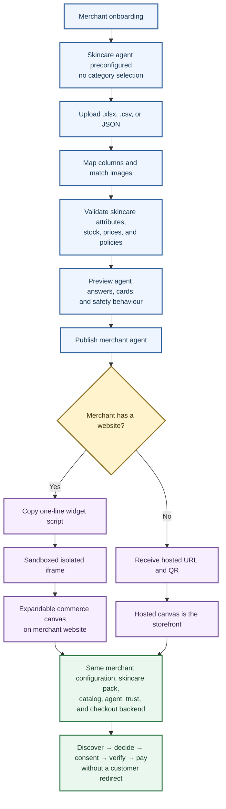
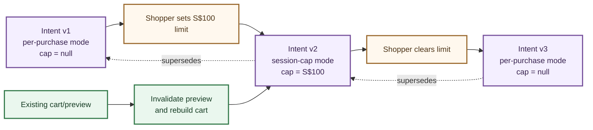
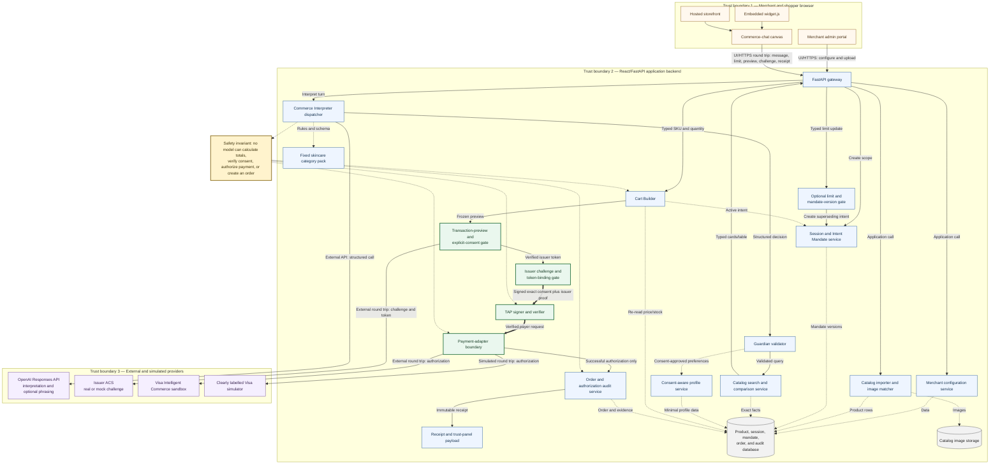

# Skincare Commerce Agent — Detailed Architecture Decision Aid

> **DRAFT — Team decision aid. This does not replace or freeze `docs/contracts.md`.**

This document describes the recommended MVP architecture after cross-checking the general platform
design against [`docs/agent-workflow.md`](./agent-workflow.md) and `docs/contracts.md` v0.11. It
incorporates three product decisions:

1. The MVP launches with exactly one shopper category: **skincare**.
2. A shopper spending limit is **optional** at session start and can be added, changed, or cleared
   later without weakening exact per-purchase consent.
3. The happy path uses **one required LLM interpretation call and at most one optional recommendation
   call**. Catalog facts, comparisons, carts, consent, trust, payment, and orders remain deterministic.

The architecture remains extensible, but the implementation and demo should optimize for one
excellent skincare journey rather than partially supporting several categories.

---

## 1. Decisions requiring team approval

| Decision | Recommended MVP | Reason | Contract impact |
|---|---|---|---|
| Shopper category | Skincare only; pack preconfigured | Deeper questions, better demo data, fewer prompts and branches | Keep `category` in data models but hide category selection |
| Category architecture | Retain `category_pack_id` internally | Preserves the scalability story without building unused packs | No public API break required |
| LLM topology | One Commerce Interpreter; optional Recommendation Phraser | Fewer calls, less latency, smaller failure surface | Refactor internal `agent/`; public endpoints can remain stable |
| Spending limit | Optional, nullable, versioned, changeable mid-session | Less onboarding friction while preserving shopper control | New limit-update operation or typed message action |
| Purchase consent | Exact cart preview plus explicit confirmation | A budget is a constraint, not permission to transact | Correct wording in workflow and UX |
| Comparison | Facts and table assembled in code | Avoids hallucinated prices, ingredients, ratings, or suitability | Comparison SSE shape can remain unchanged |
| Payment boundary | No LLM from Cart Builder downward | Makes payment safety testable and auditable | Aligns with v0.11 |
| Deployment | Embedded iframe widget plus hosted storefront | Serves merchants with and without websites | Both channels use identical backend configuration |
| Payment provider | Visa sandbox adapter plus clearly labelled simulator | Realistic integration with reliable offline demo | Adapter interface and `simulated` flag required |
| Application stack | React + FastAPI; PostgreSQL proposed | Clear UI/API split and production-shaped persistence | v0.11 currently chooses SQLite for hackathon restartability |

### Contract deltas that must be frozen by Y4

The following are recommendations, not silent contract changes:

- `docs/contracts.md` already marks `budget_cents?` optional, but the detailed workflow currently
  makes setting a budget the trigger for session creation. Session creation and budget entry must be
  decoupled.
- The current internal roster has Concierge, Discovery, and Comparison model calls. This document
  merges Concierge and Discovery and makes Comparison deterministic by default.
- A dedicated `PUT /agent/session/{session_id}/limit` operation is recommended for an explicit,
  auditable mid-session limit control. The team may instead encode it as a typed `/agent/message`
  action, but it must not depend on parsing arbitrary prose at payment time.
- The user-facing category selector is removed for the MVP, while `category="skincare"` remains in
  the stored configuration and signed scope.
- PostgreSQL versus the v0.11 SQLite choice remains a team decision. Agent and payment interfaces
  must not depend on which is selected.

---

## 2. Merchant deployment architecture

There is no category choice in the MVP merchant UI. The merchant receives a pre-built skincare
agent and configures only their catalog, policies, presentation, and deployment channel.



### 2.1 Import behaviour

The importer is deterministic application code. An LLM may suggest a column mapping, but it cannot
silently decide which source field becomes price, ingredients, stock, allergens, or SKU.

| Input | Required handling |
|---|---|
| `.xlsx` | Read the first selected worksheet, detect headers, preview mapping, require merchant confirmation |
| `.csv` | Detect encoding and delimiter, report row-level errors, never silently discard malformed rows |
| JSON | Validate against a versioned product schema and report exact failing paths |
| Images | Match by SKU or confirmed mapping; quarantine uncertain matches |
| Product URLs | Store as untrusted catalog data; never insert page text into model instructions |

Minimum normalized skincare product fields:

```jsonc
{
  "sku": "CLN-101",
  "merchant_id": "m_glow",
  "category": "skincare",
  "name": "Gentle Cloud Cleanser",
  "description": "Merchant-provided copy",
  "price_cents": 3200,
  "currency": "SGD",
  "stock": 18,
  "attributes": {
    "routine_step": "cleanser",
    "skin_types": ["dry", "normal", "sensitive"],
    "concerns": ["dryness", "barrier_support"],
    "ingredients": ["glycerin", "panthenol"],
    "excludes": ["fragrance"],
    "fragrance_free": true,
    "texture": "cream",
    "size_ml": 150
  },
  "rating_avg": 4.7,
  "rating_count": 284,
  "rating_source": "merchant_feed"
}
```

Ratings, prices, ingredient lists, and suitability tags are facts. They must originate from the
catalog or a documented ingest-time enrichment source, never from the model.

---

## 3. Shopper journey and reduced-LLM workflow

```mermaid
%%{init: {"flowchart": {"nodeSpacing": 22, "rankSpacing": 32, "wrappingWidth": 155}, "themeVariables": {"fontSize": "14px"}}}%%
flowchart TB
    OPEN["Open skincare commerce canvas"]
    SESSION["Create session\ncategory = skincare\nspending limit = null by default"]
    MESSAGE["Shopper describes need"]
    INTERPRETER["Commerce Interpreter\none structured LLM call"]
    COMPLETE{"Required information complete?"}
    CLARIFY["Ask focused clarification\nwith quick-reply controls"]
    WAIT(["Await shopper answer"])
    GUARD["Guardian validates\nschema, scope, and skincare safety"]
    CATALOG["Deterministic catalog search\nand availability lookup"]
    CARDS["Grounded product cards"]
    ACTION{"Shopper action"}

    OPEN --> SESSION --> MESSAGE --> INTERPRETER --> COMPLETE
    COMPLETE -->|No| CLARIFY --> WAIT
    COMPLETE -->|Yes| GUARD --> CATALOG --> CARDS --> ACTION

    ACTION -->|Refine| REFINE(["Await refined request"])
    ACTION -->|Compare| COMPARE["Comparison table built in code"]
    ACTION -->|Choose| SELECT["Select SKU and quantity"]

    COMPARE --> EXPLAIN{"Personalized explanation requested?"}
    EXPLAIN -->|Yes| PHRASER["Optional Recommendation Phraser\none bounded LLM call"]
    EXPLAIN -->|No| SELECT
    PHRASER --> SELECT

    CARDS -.->|Available at any time| LIMIT_UI["Set, change, or clear\noptional spending limit"]
    COMPARE -.->|Available at any time| LIMIT_UI
    LIMIT_UI --> LIMIT_MANDATE["Create superseding Intent Mandate\nand invalidate any preview"]
    LIMIT_MANDATE --> SELECT

    SELECT --> CART_GUARD["Guardian validates SKU,\nquantity, and current scope"]
    CART_GUARD --> CART["Cart Builder re-reads\nprice, stock, and fulfilment"]
    CART --> CAP{"Shopper cap exists?"}
    CAP -->|Yes| CAP_CHECK{"Cart total within cap?"}
    CAP_CHECK -->|No| CAP_DECLINE["Stop before bank\nshow products under cap"]
    CAP_CHECK -->|Yes| PREVIEW["Frozen transaction preview"]
    CAP -->|No| PREVIEW

    PREVIEW --> CONSENT{"Explicit confirmation\nfor this exact cart?"}
    CONSENT -->|No or edit| EDIT(["Return to cart or chat"])
    CONSENT -->|Yes| BANK["Separate issuer authentication"]
    BANK --> TAP["TAP payer-request verification"]
    TAP --> PAY["Deterministic authorization\nthrough one selected adapter"]
    PAY --> RESULT{"Authorization result"}
    RESULT -->|Declined| DECLINE["Explain decline\nno order; no automatic retry"]
    RESULT -->|Approved| ORDER["Create order and immutable\nauthorization record"]
    ORDER --> RECEIPT["Receipt in the same canvas"]

    RULE["No model sees raw payment credentials,\ncalculates totals, authorizes payment, or creates orders"]
    INTERPRETER -.-> RULE
    PHRASER -.-> RULE

    classDef llm fill:#eaf2ff,stroke:#2563a6,color:#173451,stroke-width:2px;
    classDef code fill:#eaf7ee,stroke:#337a4a,color:#173d25,stroke-width:2px;
    classDef user fill:#fff8ee,stroke:#9b6a2f,color:#4e3518,stroke-width:2px;
    classDef trust fill:#f4efff,stroke:#76509b,color:#38234f,stroke-width:2px;
    classDef decision fill:#fff3cd,stroke:#8a6d1d,color:#3d330d,stroke-width:2px;
    classDef failure fill:#fff0f0,stroke:#a33b3b,color:#571c1c,stroke-width:2px;
    classDef note fill:#ffffff,stroke:#4b5563,color:#1f2937,stroke-dasharray:5 5;

    class INTERPRETER,PHRASER llm;
    class SESSION,GUARD,CATALOG,COMPARE,LIMIT_MANDATE,CART_GUARD,CART,ORDER code;
    class OPEN,MESSAGE,CLARIFY,WAIT,CARDS,SELECT,LIMIT_UI,PREVIEW,CONSENT,EDIT,REFINE,RECEIPT user;
    class BANK,TAP,PAY trust;
    class COMPLETE,ACTION,EXPLAIN,CAP,CAP_CHECK,RESULT decision;
    class CAP_DECLINE,DECLINE failure;
    class RULE note;
```



### 3.1 Required versus optional shopper information

The Interpreter does not ask every shopper the same questionnaire. It checks only the fields needed
for the current intent.

| Intent | Required before execution | Optional |
|---|---|---|
| Browse by concern | Concern or desired outcome; known sensitivities when suitability filtering is requested | Skin type, texture, brand, price preference |
| Recommend a product | Product/routine step or concern; skin type when relevant; declared sensitivities/allergies | Texture, fragrance preference, rating threshold, budget |
| Compare visible products | Two or more visible SKUs; stated priority only if the shopper wants a recommendation | Additional preferences |
| Buy an exact visible SKU | SKU and quantity | Skin profile; budget cap |
| Set a spending limit | Positive amount and currency confirmation | Reason or duration |

Rules for clarification:

- Ask one concise question containing no more than three closely related missing fields.
- Prefer chips, selectors, and structured controls over free text.
- Explain why allergy, sensitivity, identity, or address information is needed.
- Do not ask for a budget merely because none exists.
- Never silently relax allergy, ingredient exclusion, merchant, currency, or shopper cap constraints.
- If no products match, show the applied filters and ask which non-safety filter may be relaxed.
- If a shopper requests diagnosis or treatment of a medical condition, explain the product boundary
  and recommend appropriate professional advice.

---

## 4. Model architecture and call budget

### 4.1 Commerce Interpreter

Concierge routing and Discovery query construction become one isolated Responses API call. The
model receives a short structured state, not the entire database or payment context.

Input:

```jsonc
{
  "session_id": "ses_01J...",
  "message": "I need a gentle cleanser for sensitive dry skin",
  "category": "skincare",
  "merchant_ids": ["m_glow"],
  "shopper_cap_cents": null,
  "visible_skus": [],
  "profile_preferences": {
    "skin_type": "dry",
    "sensitivities": ["fragrance"]
  },
  "allowed_filter_schema": {
    "routine_step": "enum",
    "skin_types": "enum[]",
    "concerns": "enum[]",
    "ingredients": "string[]",
    "excludes": "string[]",
    "fragrance_free": "boolean",
    "max_price_cents": "integer|null"
  }
}
```

Forced structured output:

```jsonc
{
  "route": "clarify | search | compare | product_detail | cart | unsupported",
  "missing_required_fields": [],
  "clarification": null,
  "catalog_query": {
    "q": "gentle cleanser",
    "merchant_ids": ["m_glow"],
    "category": "skincare",
    "filters": {
      "routine_step": "cleanser",
      "skin_types": ["dry", "sensitive"],
      "fragrance_free": true
    },
    "max_price_cents": null,
    "limit": 5
  },
  "selected_skus": [],
  "quantity": null
}
```

Guardian rejects unknown fields, invalid enum values, scope widening, invented SKUs, negative
prices, and result limits above the configured maximum. One schema repair is allowed; after that,
code falls back to a conservative keyword query or asks for clarification.

### 4.2 Deterministic comparison

Comparison rows are assembled from validated product records without a model call:

```jsonc
{
  "dimensions": [
    {
      "key": "fragrance_free",
      "label": "Fragrance free",
      "cells": [
        {"sku": "CLN-101", "value": true},
        {"sku": "CLN-205", "value": false}
      ]
    }
  ],
  "products": ["CLN-101", "CLN-205"],
  "source": "catalog_database"
}
```

The optional Recommendation Phraser receives at most three validated comparison rows and the
shopper's explicit priorities. It may explain tradeoffs, but it cannot add facts, change ranking
inputs, or state medical suitability beyond catalog tags.

### 4.3 Calls by event

| Event | LLM calls | Behaviour |
|---|---:|---|
| Widget greeting | 0 | Static greeting from the skincare pack |
| Natural-language discovery request | 1 required | Interpreter returns clarification or structured query |
| Clarification answer | 1 required | Interpreter updates the structured query |
| Catalog search and product cards | 0 | Deterministic code and database |
| Compare factual attributes | 0 | Deterministic table |
| Personalized explanation | 0 or 1 optional | Bounded Recommendation Phraser |
| Select product or change quantity | 0 | Typed UI event to Cart Builder |
| Set/change/clear spending limit | 0 | Typed UI action creates a new mandate version |
| Cart, consent, OTP, TAP, payment, receipt | 0 | Deterministic code only |

Typical happy path: **one required LLM call; two only when the shopper requests a personalized
comparison explanation.** Exact cost must be verified against the real meter rather than copied from
static estimates.

### 4.4 Context and latency controls

- Cache the fixed skincare pack and structured-output schema.
- Send structured state plus the current message, not an ever-growing transcript.
- Include only visible SKU identifiers, never full hidden catalog rows.
- Cap search results at five and recommendation input at three products.
- Use UI events for Compare, Choose, quantity, limit, Confirm, and retry; do not route button clicks
  through a model.
- Apply one model repair attempt for invalid schema, then use deterministic fallback.
- Cancel an obsolete call when the shopper sends a newer message.
- Set a per-call timeout; a timeout may block phrasing but never skip a safety or payment check.

### 4.5 Demo mode

`DEMO_MODE=1` may replace language generation, never enforcement:

| Live behaviour | Demo behaviour |
|---|---|
| Interpreter structured-output call | Keyword/attribute parser over rehearsed skincare turns |
| Optional recommendation phrasing | Template using the same validated comparison rows |
| Catalog query | Unchanged real database query |
| Guardian validation | Unchanged |
| Cart calculation | Unchanged |
| Mandate creation and supersession | Unchanged |
| Issuer binding and challenge | Unchanged, with clearly disclosed fixed demo OTP if required |
| TAP and replay checks | Unchanged or explicitly documented HMAC fallback with the same envelope |
| Authorization and refusal paths | Unchanged deterministic checks |

---

## 5. Optional spending-limit architecture

### 5.1 Semantic distinction

A search budget, a session spending limit, merchant risk controls, and purchase consent are separate:

| Concept | Example | Enforcement |
|---|---|---|
| Search preference | "Show cleansers under S$40" | Catalog query only; shopper may later browse other prices |
| Shopper session cap | "Do not let this session buy above S$100" | Signed Intent Mandate and Cart Builder |
| Merchant hard ceiling | Platform/merchant maximum transaction amount | Backend policy regardless of shopper cap |
| Purchase consent | "Confirm and pay S$38.00 for this exact cart" | Cart-bound confirmation and payment mandate |

Natural-language price wording is a search filter by default. The interface may offer an explicit
action—"Also enforce S$40 as my spending limit"—but must not silently turn a filter into delegated
payment authority.

### 5.2 Session creation without a cap

```jsonc
// POST /agent/session
{
  "merchant_id": "m_glow",
  "consumer_id": "usr_demo",
  "category": "skincare",
  "budget_cents": null
}
```

Initial intent scope:

```jsonc
{
  "mandate_id": "mnd_intent_v1",
  "type": "intent",
  "session_id": "ses_01J...",
  "version": 1,
  "supersedes": null,
  "payload": {
    "category": "skincare",
    "merchant_scope": ["m_glow"],
    "currency": "SGD",
    "constraint_mode": "per_purchase",
    "max_amount_cents": null
  },
  "expires_at": "2026-08-29T14:45:00+08:00",
  "signatures": []
}
```

No cap does not mean silent purchasing. It means the customer has not applied an additional
session-wide maximum; every purchase still requires an exact preview, explicit consent, issuer
verification, TAP verification, and authorization.

### 5.3 Add or change a cap halfway through

Recommended operation:

```jsonc
// PUT /agent/session/{session_id}/limit
{
  "budget_cents": 10000,
  "currency": "SGD",
  "source": "shopper_ui"
}
```

Response:

```jsonc
{
  "session_id": "ses_01J...",
  "intent_mandate_id": "mnd_intent_v2",
  "supersedes": "mnd_intent_v1",
  "constraint_mode": "session_cap",
  "max_amount_cents": 10000,
  "invalidated_cart_mandate_ids": ["mnd_cart_old"],
  "message": "Your S$100 spending limit now applies to this session."
}
```

The system creates and signs a new immutable Intent Mandate. It never mutates the original signed
record.



Rules:

- Setting, changing, or clearing a cap creates a new mandate version.
- Any current cart or transaction preview is invalidated because its parent intent changed.
- Cart Builder must reference the latest active intent mandate.
- A cap above the merchant hard ceiling is rejected or clamped with an explicit message according
  to the frozen contract.
- A cap at or below zero is rejected.
- If a newly set cap is below the chosen product total, show compliant alternatives immediately;
  do not wait until payment authorization.
- Clearing a cap returns to per-purchase mode but does not remove explicit confirmation.
- Trust Panel shows the active cap and the supersession event.

---

## 6. Three-boundary technical architecture



### Line semantics

| Diagram line | Meaning |
|---|---|
| Solid arrow labelled `UI/HTTPS` | Browser request or response through the canvas |
| Dotted arrow labelled `Data`, `Rules`, or `Facts` | Deterministic read/write or tool access |
| Thick arrow labelled `Signed` or `Verified` | Cryptographically protected trust transition |
| Solid arrow labelled `External` | Provider call across the application boundary |

---

## 7. Component responsibilities and permissions

| Component | Receives | Produces | May access | Forbidden |
|---|---|---|---|---|
| Commerce Interpreter | Current message, short state, skincare schema, safe preferences | Route, clarification, or CatalogQuery | Fixed pack and structured model call | Product DB, card data, raw identity, payment token, order tools |
| Guardian | Every structured model output and selected-product request | Pass, repair once, fallback, or refusal plus trust event | Schemas, session scope, catalog rows for validation | User-facing invention, payment authorization |
| Catalog Service | Validated query | Exact products, facets, stock, deterministic comparison | Product database | Model-generated prices or attributes |
| Recommendation Phraser | ≤3 validated comparison rows and priorities | Optional tradeoff explanation with SKU citations | Bounded model call | New facts, medical diagnosis, direct tools, cart/payment |
| Session/Mandate Service | Session creation and typed cap updates | Immutable versioned intent scope | Mandate store and signing keys | Mutating signed history |
| Cart Builder | SKU, quantity, active intent, fulfilment details | Cart hash, cart mandate, frozen preview | Product DB, address service, policy rules | Model output as price truth, authorization |
| Issuer ACS | Cart hash, amount, merchant, challenge response | Cart-bound single-use issuer token | Separate challenge/token store | Full agent transcript, product recommendation logic |
| TAP Verifier | Canonical payer request, signature, nonce, key ID, tags | Verified request or hard rejection | Trusted key registry and nonce cache | Treating browser-auth as payer-auth |
| Payment Executor | Verified payer request and issuer token | One normalized approved/declined result | One selected adapter, mandate chain, idempotency store | Model calls, automatic business-decline retry |
| Order/Audit Writer | Successful authorization and frozen evidence | Order, authorization record, receipt | Transactional database and trust event bus | Order creation on decline |

---

## 8. Runtime phases

### Phase A — Open and create scope

1. Merchant configuration loads before a shopper session exists.
2. The skincare pack is fixed by merchant configuration; the customer never selects a category.
3. A session is created on the shopper's first meaningful interaction, not only after setting a cap.
4. Initial `budget_cents` may be `null`.
5. Session/Mandate Service creates the first signed intent version in per-purchase mode.
6. Static pack text provides the greeting without an LLM call.

### Phase B — Interpret and clarify

1. Commerce Interpreter receives one message and compact structured state.
2. It chooses `clarify`, `search`, `compare`, `product_detail`, `cart`, or `unsupported` under a
   strict schema.
3. When required information is missing, the server returns a typed clarification block and stops.
4. Guardian validates all fields before a catalog tool sees them.
5. The system does not ask for a budget unless it is necessary to satisfy the user's stated request.

### Phase C — Search and display

1. Catalog Service executes only validated filters.
2. Ranking is deterministic and stable across repeated demos.
3. Product cards are assembled in code from exact rows.
4. Ingredient and suitability text is displayed as merchant/catalog data, not model recollection.
5. Zero results prompt the shopper to relax a non-safety constraint.

### Phase D — Compare and decide

1. The shopper chooses two or more visible products.
2. Code re-reads the rows and builds the factual table.
3. If the shopper requests help deciding, Recommendation Phraser receives at most three rows.
4. Guardian verifies each referenced SKU and factual claim.
5. A failed phrasing call leaves the deterministic table fully usable.

### Phase E — Optional cap update

1. Shopper may set, change, or clear a cap from cards, comparison, or cart.
2. The UI sends a typed amount and currency, not only prose.
3. Session/Mandate Service signs a new intent version that supersedes the previous version.
4. Existing cart previews are invalidated.
5. If selected products exceed the new cap, compliant alternatives appear immediately.

### Phase F — Cart and consent

1. Cart Builder accepts only SKU and quantity from the agent/UI boundary.
2. It re-reads price, stock, currency, tax, shipping, merchant, and address.
3. If a shopper cap exists, it enforces `total_cents <= max_amount_cents` before bank contact.
4. It creates a signed cart mandate and hash over all consequential fields.
5. The canvas displays an exact transaction preview.
6. The shopper explicitly confirms or edits; silence and a previous cap are not consent.

### Phase G — Issuer, TAP, and payment

1. Issuer challenge is bound to cart hash, amount, currency, and merchant.
2. Shopper completes the issuer challenge directly; OTP content never enters a model prompt.
3. TAP signer creates `agent-payer-auth`; verifier checks key, signature base, time, nonce, tag, and
   linked mandate.
4. Payment Executor validates the mandate chain, cart hash, issuer token, merchant, amount, cap,
   token use, and human confirmation.
5. Exactly one selected provider receives an idempotent authorization request.
6. Business declines create no order and are never retried automatically.
7. Approval atomically consumes single-use credentials and creates the order/audit record.
8. Receipt appears in the same embedded or hosted canvas.

---

## 9. Trust stages and non-negotiable invariants

Trust is a sequence, not one green badge:

1. **Catalog grounding:** SKU, ingredients, price, rating, stock, and suitability tags match the DB.
2. **Intent scope:** category is skincare, merchant is allowed, mandate is active, cap is optional.
3. **Cart integrity:** totals and fulfilment are recalculated and bound into a cart hash.
4. **Explicit consent:** customer confirms exact item, quantity, merchant, amount, currency, and card.
5. **Issuer authentication:** issuer token is fresh, single-use, and cart-bound.
6. **TAP verification:** payer request signature, tag, timestamp, nonce, and key are valid.
7. **Authorization:** provider returns approved or declined.
8. **Order evidence:** only approval creates an order and immutable receipt record.

Non-negotiable invariants:

- Raw PAN, CVV, private keys, OTP values, and full identity documents never enter model context.
- Product and spreadsheet text are untrusted data, never instructions.
- Models cannot access Cart Builder, issuer, TAP, payment adapter, or order writer tools.
- Search budget is not automatically a shopper cap.
- Shopper cap is not purchase consent.
- Updating a cap invalidates a previously calculated preview.
- No order is created without successful authorization.
- Simulator mode is visible before confirmation and on the receipt.
- Payment idempotency survives double-clicks and network retries.

---

## 10. Failure and recovery matrix

| Failure | Detection stage | Behaviour | User experience |
|---|---|---|---|
| Missing skin information | Interpreter completeness check | Stop and clarify | One focused question with chips |
| Unsafe medical request | Guardian skincare safety | Refuse diagnosis/treatment claim | Explain boundary and suggest professional help |
| Invalid model schema | Guardian | Repair once, then deterministic fallback | No fabricated results |
| Zero products | Catalog Service | Preserve hard constraints | Show filters and ask which optional preference to relax |
| Prompt injection in catalog | Import/Catalog/Guardian | Treat as data and flag | Product may be quarantined; no instruction execution |
| Recommendation ungrounded | Guardian | Drop prose, keep deterministic table | Verified comparison remains available |
| Cap update below cart | Mandate/Cart Builder | Invalidate preview; stop before bank | Show compliant alternatives |
| Price or stock changed | Cart Builder | Recalculate and invalidate consent | Highlight change and ask for new confirmation |
| Cart expired | Mandate Service | Rebuild from current facts | No silent re-signing |
| Issuer challenge failed | Issuer ACS | Stop | No payment and no order |
| TAP signature invalid | TAP Verifier | Hard reject | Explain request could not be verified |
| Replay detected | TAP/Payment | Reject consumed nonce/token | No duplicate transaction |
| Authorization declined | Payment Adapter | Return normalized decline; no order | Clear reason and explicit next choices |
| Duplicate submission | Idempotency store | Return stored result | One transaction and one receipt |
| OpenAI unavailable | Interpreter/Phraser | Demo parser or deterministic UI fallback | Search/payment enforcement continues |
| Visa sandbox unavailable | Adapter | Use simulator only when preselected and disclosed | `simulated=true` shown throughout |

---

## 11. Data ownership and persistence

| Record | Owner | Mutable? | Notes |
|---|---|---:|---|
| Merchant configuration | Merchant service | Yes, versioned | Both deployment channels read the same version |
| Skincare category pack | Agent configuration owner | Versioned release artifact | One active pack in MVP |
| Product catalog | Merchant service | Yes | Cart pins/re-reads current authoritative values |
| Session state | Agent/session service | Yes | Contains structured state, not payment secrets |
| Intent Mandate | Mandate service | No | New cap creates a superseding record |
| Cart Mandate | Cart Builder/payment domain | No | Bound to intent version and cart hash |
| Consent evidence | Payment domain | No | Bound to exact preview |
| Issuer token | Issuer ACS | State transition only | Fresh → consumed/expired/locked |
| Payment token | Payment domain | State transition only | Constrained and single-use in demo design |
| Authorization | Payment domain | No | Approved or declined evidence |
| Order/receipt | Order/Audit service | No after creation | Exists only after approval |
| Trust event | Audit service | Append-only | Redacted safe metadata only |

Database choice must preserve transactions for consuming credentials and writing authorization/order
evidence atomically. If the hackathon uses SQLite, enable foreign keys and explicit transactions. If
the team chooses PostgreSQL, keep the same repository interfaces so the agent and UI do not change.

---

## 12. Scalability beyond the skincare MVP

One visible category does not mean a skincare-only platform architecture.

Keep these abstractions now:

- `category_pack_id` on merchant configuration and session.
- Versioned `attribute_schema`, `salient_dims`, `comparison_dimensions`, and safety rules.
- Generic `Product.attributes` validated against the selected pack.
- Deterministic CatalogQuery schema generated from the active pack.
- Category-specific clarification requirements loaded as data.
- A new-session rule when a future shopper switches category.

Do not build these before the skincare path is reliable:

- Category-selection UI.
- Multiple active packs in one session.
- Fine-tuned models per category.
- Cross-category recommendation or comparison.
- Cross-merchant split settlement.
- A separate LLM subagent for every category.

Adding a second category later should mean adding a validated pack, catalog schema, seeded data,
safety tests, and presentation configuration—not changing payment or trust code.

---

## 13. Validation and test checklist

### Architecture

- [ ] Embedded and hosted channels converge on the same backend.
- [ ] Merchant onboarding has no category selector in the skincare MVP.
- [ ] `category="skincare"` remains explicit in stored and signed scope.
- [ ] The model has no direct edge to Cart Builder, TAP, adapter, or order writer.
- [ ] Issuer authentication, TAP verification, authorization, and order creation remain distinct.

### Spending limit

- [ ] Session starts with `budget_cents=null`.
- [ ] Discovery works without a cap.
- [ ] A cap can be set from product cards, comparison, or cart.
- [ ] Updating/clearing the cap creates a new intent version.
- [ ] Old carts/previews are invalidated after an intent update.
- [ ] No-cap mode still requires exact confirmation.
- [ ] A natural-language search budget does not silently become a payment cap.

### LLM calls

- [ ] Static greeting makes no model call.
- [ ] One structured Interpreter call replaces Concierge plus Discovery.
- [ ] Compare button produces a correct table without a model call.
- [ ] Optional Recommendation Phraser sees at most three validated rows.
- [ ] All model outputs pass Guardian.
- [ ] Direct UI actions bypass model routing.
- [ ] Happy path uses one required and no more than one optional model call.

### Skincare safety

- [ ] Sensitive/allergy exclusions are hard constraints.
- [ ] Medical diagnosis or treatment requests receive a safe boundary response.
- [ ] Product claims match catalog fields.
- [ ] Ingredient and suitability information is traceable to its source.
- [ ] Missing ratings render as no rating, not zero stars.

### Payment and trust

- [ ] Cart totals originate only from server calculation.
- [ ] Consent is bound to exact cart hash, amount, merchant, currency, and expiry.
- [ ] Issuer token is cart-bound, short-lived, and single-use.
- [ ] Browser-auth cannot access payer-auth routes.
- [ ] Nonce replay and duplicate payment submissions are rejected/idempotent.
- [ ] Declines never create orders.
- [ ] Simulator transactions are clearly labelled before and after consent.

---

## 14. Decision notes

| Decision | Recommended | Alternative | Main tradeoff |
|---|---|---|---|
| MVP category | Fixed skincare pack | Multiple selectable packs | Depth and reliability versus broader demo surface |
| Language agent | One Commerce Interpreter | Concierge plus Discovery calls | Lower cost/latency versus stronger context isolation |
| Comparison | Deterministic table; optional phrasing | Always invoke Comparison LLM | Grounding and cost versus richer prose every time |
| Session cap | Optional and versioned | Mandatory before session | Lower friction versus an earlier visible control |
| Mid-session cap | New superseding mandate | Mutate current session/mandate | Auditability versus simpler storage |
| Search price | Preference by default | Automatically enforce as cap | Natural UX versus stronger implicit control |
| No website | Hosted commerce storefront | Require external website | Immediate SME access versus custom storefront ownership |
| Website integration | Sandboxed script/iframe | Native platform plugin | Universal installation versus deeper integration |
| Payment | Visa sandbox adapter plus simulator | Sandbox-only | Demo reliability versus stricter live dependency |
| Persistence | Team decision: PostgreSQL proposal, SQLite fallback | One choice hard-coded into services | Production shape versus restart simplicity |

---

## 15. Source notes

- [Visa Trusted Agent Protocol specification](https://developer.visa.com/capabilities/trusted-agent-protocol/trusted-agent-protocol-specifications/)
  defines signed recognition and payment interactions, intent tags, keys, timestamps, and nonces.
- [Visa Trusted Agent Protocol reference implementation](https://github.com/visa/trusted-agent-protocol)
  demonstrates agent signing, merchant verification, a registry, and RFC 9421-shaped requests.
- [Visa Intelligent Commerce overview](https://developer.visa.com/capabilities/visa-intelligent-commerce/overview)
  describes agent-specific payment credentials, authenticated payment instructions, controls, and
  sandbox availability.
- [Visa Intelligent Commerce reference agent](https://github.com/visa/vic-reference-agent)
  demonstrates the broader token, passkey, payment-instruction, and agent integration shape.
- [OpenAI Responses API reference](https://developers.openai.com/api/reference/cli/resources/responses/methods/create)
  documents structured function tools used for the single Interpreter and optional Phraser calls.
- [`docs/contracts.md`](./contracts.md) v0.11 remains the current internal HTTP and type authority.
- [`docs/agent-workflow.md`](./agent-workflow.md) remains the current step-by-step implementation
  specification until the team approves and ports the deltas in this decision aid.

---

## 16. Huddle freeze checklist

- [ ] Approve skincare as the only visible MVP category.
- [ ] Approve removal of category selection from merchant onboarding.
- [ ] Approve one Interpreter call replacing Concierge plus Discovery.
- [ ] Approve deterministic comparison plus optional phrasing call.
- [ ] Approve session creation without a shopper cap.
- [ ] Approve the distinction between search budget, session cap, and purchase consent.
- [ ] Choose the limit-update API shape and mandate supersession fields.
- [ ] Confirm that changing a cap invalidates all current previews.
- [ ] Confirm PostgreSQL versus SQLite for the hackathon build.
- [ ] Confirm issuer UX and demo OTP disclosure.
- [ ] Confirm Visa sandbox credential deadline and simulator fallback rule.
- [ ] Port approved API/type changes into Y4-owned `docs/contracts.md` before implementation treats
  them as frozen.
